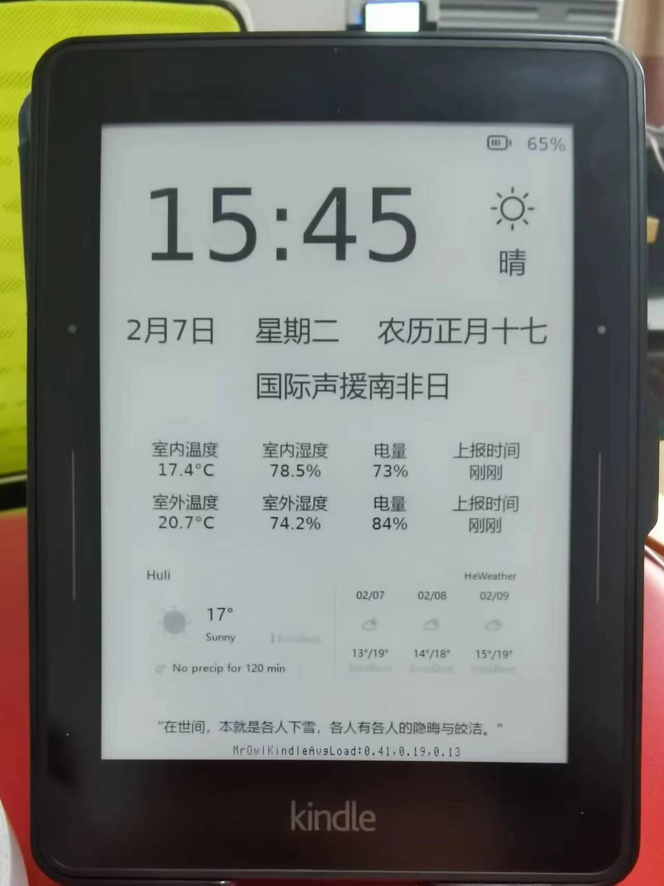
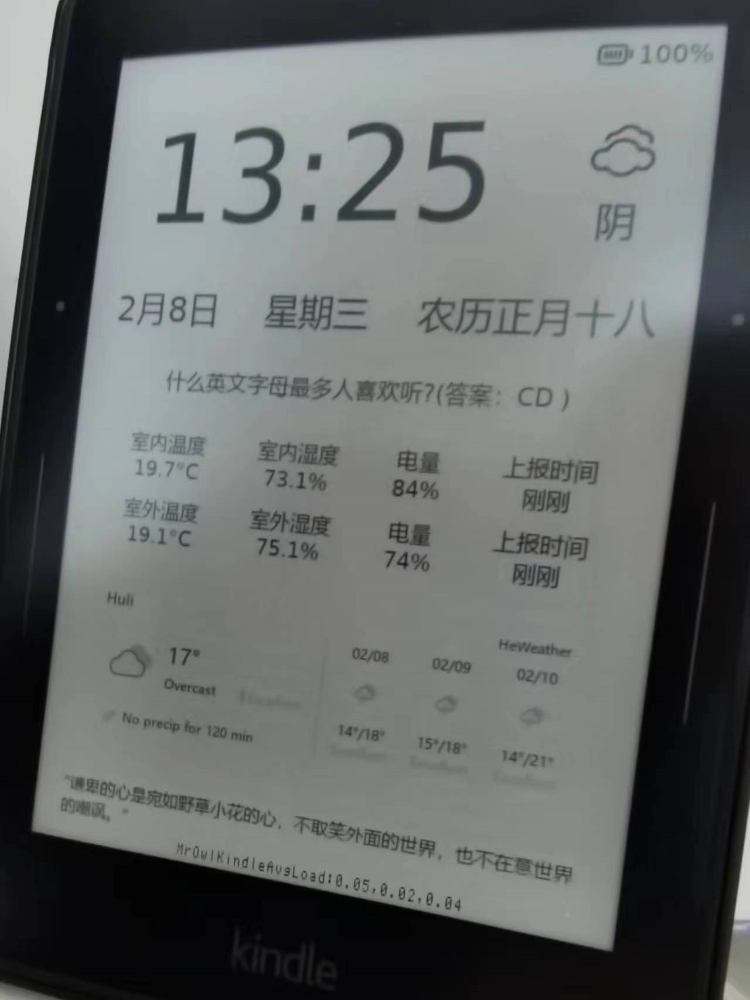

# KINDLE_CALENDAR



## 简介

将吃灰已久的kindle改造为台历的项目。目前仅适配`kindle voyage`（仅在5.12.x版本测试通过）。如果需要在其他型号的kindle上运行，请参考下文。经过测试，在关闭冗余进程并持续联网的情况下，一台购买于2018年并吃灰已久的kv，两小时内的耗电量约为8%-10%。考虑到存在的电池损耗，这是相当理想的功耗了。

项目灵感来源自[lankybutmacho/web-to-kindle-heroku](https://github.com/lankybutmacho/web-to-kindle-heroku)以及[Your next smart home device is a $30 used Kindle](https://matthealy.com/kindle)，作者利用node实现自动化的网页截图，并利用已越狱的kindle从部署好的服务端定时自动拉取截图显示在屏幕上。

上图显示的室内外温度是我利用esp32收集米家蓝牙温湿度计的数据所得到的。这一块可以进行变更，在此仅提供esp32的[micropy代码](./esp32_micropy)（解析pvvx格式，详见[pvvx](https://github.com/pvvx/ATC_MiThermometer)）。值得注意的是，使用urequests时不建议走https,否则内存可能溢出。**如需实现上图效果，需要自行实现相关服务端代码，具体就是接收esp32发来的json，并提供地址供js下载。当然，也可以使用其他方式利用你的传感器收集温度！**

代码可能有点丑陋，那是因为我前端只会一点皮毛（

## 开始...

**警告：kindle越狱有风险！因为使用本项目带来的后果笔者不承担责任！**

### 准备工作

+ （可选）esp32
+ （可选）米家蓝牙温湿度计x2
+ 一台已经越狱或刷成android 4.4+的kindle voyage，步骤不难，下文不再赘述
+ 能24h运行的x86架构linux服务器，不要求公网ip

### 服务器端

如果使用android系统的kindle,可忽略这一部分。


首先，请将frontend内的相关文件复制到服务器内，开通天行api以及和风天气的相关服务，获取key后填写入fetch.py中，并运行：

```shell
python3 fetch.py
```

这一py文件的目的是缓存从第三方服务请求来的信息，避免重复请求造成损失。

天行需要开通的服务有：

[脑筋急转弯](https://www.tianapi.com/apiview/28)，[ONE一个](https://www.tianapi.com/apiview/129)，[中国老黄历](https://www.tianapi.com/apiview/45)，

和风天气只需申请key即可。同时注意开通[标准版天气插件]([https://widget.qweather.com/create-standard),将得到的config填入frontend的html中。记得同时查询一下你所在地区对应代码，填入js的currpos里（https://github.com/qwd/LocationList）

记得解压img.zip

**如果需要使用传感器数据，请把js内对应地址改为你的服务地址**

使用nginx或其他webserver代理这一html,并确保能够curl到，且请求到的css样式和页面数据正常。记下这一地址。笔者偷懒，这里不再赘述。

之后，将backend文件夹内所有文件放入服务器内，修改app.json和index.js内对应配置。其中app.json需修改的是需要截图的地址。填写上文记下的地址。

index.js内请修改截图尺寸。可以参考linux `convert`命令参数填写args.

**如果需要适配其它型号的kindle，请注意自行适配前端部分并修改截图尺寸。**


接下来请确保具有node12+环境。

首先复制fonts文件夹里的字体（解压一下）到/usr/share/fonts内，避免后序截图中文乱码。

如没有，请运行如下指令(debian系,仅在ubuntu 22.04测试通过，但其他发行版应该大致相同)：

```sh
sudo apt update 
sudo apt install nodejs npm
```

接下来安装puppeteer（自动化截图工具）所需依赖：

**注意，服务器只能是x86!**

```sh
sudo apt install libnss3-dev libgdk-pixbuf2.0-dev libgtk-3-dev libxss-dev libasound2 -y
```

进入backend/app后，使用npm运行：

```sh
npm install
npm start
```

~~如有安装docker,也可使用backend文件夹内的dockerfile:~~不建议

```sh
docker build -t sydneyowl/kindle_screenshot .
docker run -d -p 3000:3000 (hash)
```

试着访问服务器ip:3000，并观察日志，检验截图是否正常。


### kindle端

#### 安卓

请按照上文所述申请api,并填入js中，使用5+app打包成apk。打包时至少需要`wake_lock`和`battery_status`两个权限。放到kindle上运行即可。

这种方法部署简单，但是非常耗电。

如果要使用传感器，记得改api

#### 原生系统

请先利用`kual`安装nsbnetwork（参考[USBNetwork Hack 安装教程](https://bookfere.com/post/59.html)）。ssh到kindle后:

运行`eips -c`并观察屏幕。**如果屏幕没有清空，请停止以下步骤，因为该方法与你的kindle不兼容**

接下来挂载kindle的文件系统：先运行`mntroot rw`使文件系统可写，将configs文件夹复制到你的kindle中，修改displaySaver.sh中对应地址到你的截图服务地址

首先运行文件夹内的disableServices.sh尝试关闭冗余服务，如果出现任何异常，请不要继续。

如果没有出现异常，请继续运行displaySaver.sh。如果屏幕没有按预期显示截图，也请停止执行。

如果均未出现异常，恭喜你的kindle能够正常运行日历啦！接下来我们只需要加入开机启动项和crontab即可。

将两个脚本文件复制到`/mnt/us`内，再将conf文件复制到`/etc/upstart`内，最后`nano /etc/crontab/root`,加入一行`* * * * * /mnt/us/displaySaver.sh`,最后reboot下，你的日历大概就ok了。

### 最后...

估计这个教程有挺多问题...有任何问题欢迎提issue!
