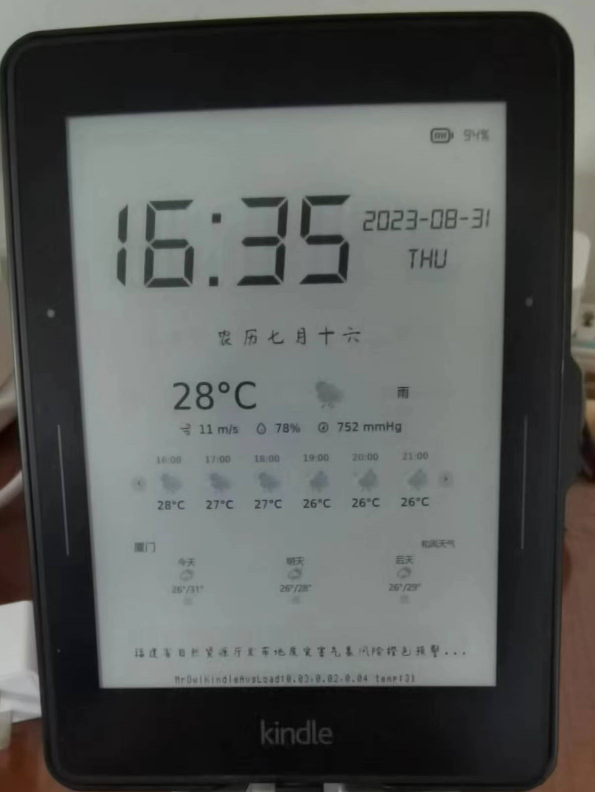

# KINDLE_CALENDAR



## 简介

将吃灰已久的kindle改造为台历的项目。目前仅适配 `kindle voyage`（仅在5.12.x版本测试通过）。如果需要在其他型号的kindle上运行，请参考下文。经过测试，在关闭冗余进程并持续联网的情况下，一台购买于2018年并吃灰已久的kv，两小时内的耗电量约为8%-10%。考虑到存在的电池损耗，这是相当理想的功耗了。

项目灵感来源自[lankybutmacho/web-to-kindle-heroku](https://github.com/lankybutmacho/web-to-kindle-heroku)以及[Your next smart home device is a $30 used Kindle](https://matthealy.com/kindle)，作者利用node实现自动化的网页截图，并利用已越狱的kindle从部署好的服务端定时自动拉取截图显示在屏幕上。

代码可能有点丑陋，那是因为我前端只会一点皮毛（

## 开始...

**警告：kindle越狱有风险！因为使用本项目带来的后果笔者不承担责任！**

### 准备工作

+ 一台已经越狱的kindle voyage，步骤不难，下文不再赘述
+ 能24h运行的x86架构linux服务器，不要求公网ip
+ 几个API key:
  + 和风天气需申请key以及小组件。 对于手动部署，注意开通[标准版天气插件](https://widget.qweather.com/create-standard),将得到的配置填入frontend的html中，申请的key填入backend/fetch.py的HEFENG_KEY中。注意同时替换CURR_POS为你当前的位置。具体请查看和风天气api
  + 天行api需要申请key，并开通ONE一个、中国老黄历，对于手动部署，填入fetch.py的APIKEY中

### 服务器端

#### DOCKER

示例代码：

``````sh
sudo docker run --init -d -p 3000:3000 -e TIANAPI=<TIANAPI> -e HEFENGAPI=<HEFENGAPI> -e CURRPOS=<CURRPOS> -e CITY=<CITY> -e WIDGETKEY=<WIDGETKEY> sydneymrcat/kindle-calendar
``````

替换尖括号里的内容即可。请先安装docker!

<TIANAPI>: www.tianapi.com

<HEFENGAPI>: [qweather.com](https://www.qweather.com/)

<CURRPOS>: [LocationList/China-City-List-latest.csv at master · qwd/LocationList (github.com)](https://github.com/qwd/LocationList/blob/master/China-City-List-latest.csv)中的location id

<CITY> 和 <WIDGETKEY>:https://widget.qweather.com/create-standard 生成的json对应city和key

#### 手动部署

首先，请将frontend内的相关文件复制到服务器内，开通天行api以及和风天气的相关服务，获取key后填写入fetch.py中，并运行：

```shell
python3 fetch.py
```

这一py文件的目的是缓存从第三方服务请求来的信息，避免重复请求造成损失。

请提前申请api key,并替换前端文件html中标识为【请替换】的部分

请记得修改js文件的api请求路径。js会请求fetch.py启动的后端，确保ip正确。

使用nginx或其他webserver代理这一html,并确保能够curl到，且请求到的css样式和页面数据正常。笔者偷懒，这里不再赘述。

之后，将backend文件夹内所有文件放入服务器内，修改app.json和index.js内对应配置。需修改的是需要截图的地址，即访问上文经代理的网页地址。

index.js内请修改截图尺寸。可以参考linux `convert`命令参数填写args. 如果你也是kindle voyage就不用管了

**如果需要适配其它型号的kindle，请注意自行适配前端部分并修改截图尺寸。**

首先复制fonts文件夹里的字体到/usr/share/fonts内，避免后序截图中文乱码。

接下来请确保具有node12+环境。

如没有，请运行如下指令(debian系,仅在ubuntu 22.04测试通过，但其他发行版应该大致相同)：

```sh
sudo apt update 
sudo apt install nodejs npm
```

接下来安装puppeteer（自动化截图工具）所需依赖：

**注意，服务器只能是x86!**

```sh
sudo apt install libnss3-dev libgdk-pixbuf2.0-dev libgtk-3-dev libxss-dev libasound2 -y
```

进入backend/app后，使用npm运行：

```sh
npm install
npm start
```

试着访问服务器ip:3000，并观察日志，检验截图是否正常。

### kindle端

请先利用 `kual`安装nsbnetwork（参考[USBNetwork Hack 安装教程](https://bookfere.com/post/59.html)）。ssh到kindle后:

运行 `eips -c`并观察屏幕。**如果屏幕没有清空，请停止以下步骤，因为该方法与你的kindle不兼容**

接下来挂载kindle的文件系统：先运行 `mntroot rw`使文件系统可写，将configs文件夹复制到你的kindle中，修改displaySaver.sh中对应地址到你的截图服务地址

首先运行文件夹内的disableServices.sh尝试关闭冗余服务，如果出现任何异常，请不要继续。

如果没有出现异常，请继续运行displaySaver.sh。注意把脚本中的地址改为你的服务器地址。如果屏幕没有按预期显示截图，也请停止执行。

如果均未出现异常，恭喜你的kindle能够正常运行日历啦！接下来我们只需要加入开机启动项和crontab即可。

将两个脚本文件复制到 `/mnt/us`内，再将conf文件复制到 `/etc/upstart`内，最后 `nano /etc/crontab/root`,加入一行 `* * * * * /mnt/us/displaySaver.sh`,最后reboot下，你的日历大概就ok了。

### 最后...

估计这个教程有挺多问题...有任何问题欢迎提issue!
